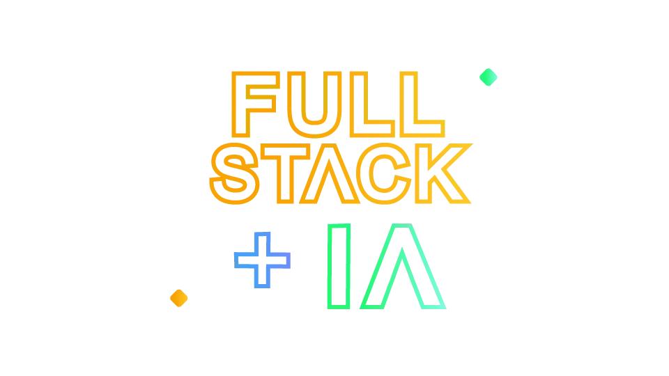

# 🧑‍💻 Portfolio Project

<div align="center">



<div data-badges>
  
    
    
    
    
    
    
    
</div>

</div>

Portfolio Project is a full-stack application that integrates popular market technologies to create a digital showcase of a developer's skills and projects. This platform goes beyond simply displaying past work, functioning as a practical demonstration of the professional's technical capabilities, highlighting their mastery in modern web development.

In addition to presenting the developer's projects, the application incorporates intelligent AI agents that have full access to the professional's resume, GitHub repositories, and history. This integration allows recruiters and potential clients to explore, through real-time chat interactions, specific aspects of the developer's technical skills. The chats with the agents offer valuable insights, allowing visitors to ask questions and receive detailed information about the professional's skills and experiences, making the evaluation process more dynamic and informative.

## 🖥️ How to run 🖥️

### Requisites:

- Node.js 20+

### Run:

1. Clone this repo:

   ```sh
   git clone https://github.com/rafarocha28/portfolio-project.git
   ```

2. Acess the root folder:

   ```sh
   cd portfolio-project
   ```

3. Acess or create your [Supabase](https://supabase.com) account.

4. Navigate to the Supabase project and click `connect`.
5. Select ORM Prisma.
6. Use these variables in a `.env` file inside the folder backend:

   ```
   DATABASE_URL=
   DIRECT_URL=
   PORT=
   ```

   **Obs: Default port is 4000**

7. Create a workflow in [n8n](https://n8n.io) to communicate with an AI agent.

8. In `webhooks url`, copy `Production URL` value.
   **Obs: Remember to activate the workflow in n8n**

9. Create a `.env` file inside the frontend folder. API URL is your backend URL, and CHAT_WEBHOOK is your n8n workflow production URL:

   ```
   NEXT_PUBLIC_API_URL=
   NEXT_PUBLIC_CHAT_WEBHOOK=
   ```

10. Install dependencies of project `frontend` and `backend` via `yarn`.

11. Run both at the same time with `yarn dev`. It uses the `concurrently` command.

## 🗒️ Features 🗒️

- AI Agent integration via Chat
- Projects view
- Highlight techs
- Techs used in projects


## 💎 Useful links 💎

- [Next.js](https://nextjs.org/docs)
- [NestJS](https://docs.nestjs.com/)
- [Prisma](https://www.prisma.io/docs)
- [Supabase](https://supabase.com)
